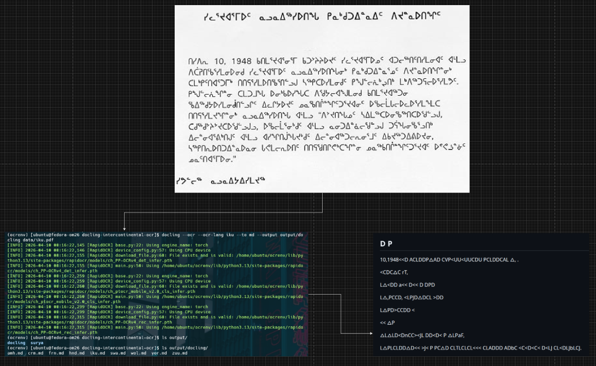

# Fedora issue #123: Assignment submission document for the _processing multilingual documents_ phase 2 task.

As an Outreachy contributor at the [Fedora project](https://fedoraproject.org/), I completed an assigned task using [Docling](https://docling-project.github.io/docling/), an open-source optical character recognition (OCR) library, to convert scanned non-English documents (PDFs in my case) into machine-readable, editable digital text. Optionally, I completed the task using another OCR engine called [Surya](https://github.com/datalab-to/surya) with the intent of analyzing and comparing its results with those of Docling through performance and output evaluation.

## OCR Performance on Non-Latin Scripts

As an example, before getting started, this image demonstrates **Docling** processing the **Universal Declaration of Human Rights (UDHR)** in **Inuktitut (South Baffin)**.



*   **Bottom Left:** The terminal logs showing the `docling` command execution and the underlying **RapidOCR** engine initializing the necessary model files.
*   **Top:** The original source text written in **Canadian Aboriginal Syllabics**.
*   **Bottom Right:** The resulting **OCR Markdown output**, showing the tool's ability to capture the specific syllabic characters (e.g., ᐃᓄᒃᑎᑐᑦ) from the source.

---

## Repository Structure

```
.
├── assets/
│   ├── creating_ocr_virtual_env_with_python.png
│   ├── docling_ocr_running_on_scanned_pdf_to_md.png
│   ├── docling_ocr_version_output.png
│   ├── docling_performance_output.png
│   ├── loging_in_fedora_vm_with_multipasss.png
│   ├── surya_ocr_installation.png
│   ├── surya_ocr_running_on_scanned_pdf_to_markdown.png
│   ├── surya_ocr_version_output.png
│   └── tesseract_ocr_engine_version_output.png
│
├── data/
│   ├── amh.pdf
│   ├── crm.pdf
│   ├── frn.pdf
│   ├── hnd.pdf
│   ├── iku.pdf
│   ├── swa.pdf
│   ├── wol.pdf
│   ├── yor.pdf
│   └── zuu.pdf
│
├── output/
│   ├── docling/
│   │   ├── amh.md
│   │   ├── crm.md
│   │   ├── frn.md
│   │   ├── hnd.md
│   │   ├── iku.md
│   │   ├── swa.md
│   │   ├── wol.md
│   │   ├── yor.md
│   │   └── zuu.md
│   │
│   └── surya/
│       ├── amh_layout.json
│       ├── amh_page1.png
│       ├── frn_layout.json
│       ├── frn_page1.png
│       └── ... (remaining Surya output files)
│
├── README.md
└── LICENSE
```

---

## Table of Contents

1. [**Environment Setup (Fedora VM)**](#task-completion-environment-setup)
2. [**The Core Task: Implementation Workflow**](#the-core-task-getting-started-with-docling-and-the-optional-surya-to-perform-task-completion)
    * [Environment Isolation & Dependencies](#the-core-task-getting-started-with-docling-and-the-optional-surya-to-perform-task-completion)
    * [Dataset: Intercontinental UDHR](#4-the-intercontinental-dataset-udhr)
    * [OCR Output Directories](#5-ocr-output-directories)
3. [**Verification of Generated Outputs**](#to-verify-the-generated-outputs)
    * [Docling (Structured Markdown)](#docling-structured-outputs)
    * [Surya (Layout & Detection)](#surya-layout--detection-outputs)
4. [**Architectural Analysis & Technical Comparison**](#comparative-analysis--evaluation)
    * [Pipeline vs. Engine Distinction](#architectural-distinction-pipeline-vs-engine)
    * [Multi-Engine Performance Benchmark (Tesseract vs. Surya vs. Docling)](#multi-engine-performance-benchmark-tesseract-vs-surya-vs-docling)
    * [The Core Objective: Pipeline Alignment](#the-core-objective-why-pipeline-alignment-matters)
5. [**CLI & Language Handling Analysis**](#cli--language-handling-analysis)
6. [**Final Evaluation: Primary Project Deliverable**](#why-markdown-is-the-primary-deliverable)
    * [Why Markdown is the Primary Deliverable](#why-markdown-is-the-primary-deliverable)
7. [**Acknowledgements**](#acknowledgement)

---

## Task completion environment setup

I chose a Fedora-powered VM over a local Python virtual environment, firstly because it's Fedora, so I had to use a Fedora Linux server to work. Secondly, I have a 32GB laptop with 2T of storage, so there is enough room to host a Fedora VM on my local Ubuntu to isolate it. The setup was done with [multipass](https://canonical.com/multipass), the canonical CLI VM creator, with a downloaded [Fedora 43 Cloud Image](https://www.fedoraproject.org/cloud/download/) with the following configurations: x86_64 Intel kernel with 4 CPUs, 8GB RAM, and 50GB Disk.

Here is how I did that, and yours may vary based on your choice of development environment :

```bash
multipass launch file:///home/gtfrans2re/Downloads/Fedora-Cloud-Base-Generic-43-1.6.x86_64.qcow2 \
  --name fedora-om26 \
  --cpus 4 \
  --memory 8G \
  --disk 50G
```

verified successful installation:
```bash
multipass list | grep -E "fedora"
```

And logged into the Fedora VM:
```bash
multipass shell fedora-om26
```


Updated and installed Base Build tools:
```bash
sudo dnf update -y
sudo dnf install -y gcc gcc-c++ python3-devel libjpeg-devel zlib-devel tesseract tesseract-devel
```

installed language packages with Tesserract to match the intercontinental context (North America, Europe, Africa, and Asia):
```bash
# Installing  packs for French, Hindi, African languages, and Indigenous scripts
sudo dnf install -y tesseract-langpack-fra tesseract-langpack-hin \
  tesseract-langpack-swa tesseract-langpack-yor tesseract-langpack-amh \
  tesseract-langpack-zul tesseract-langpack-wol tesseract-langpack-swa \
  tesseract-langpack-cre tesseract-langpack-iku
```
This ensured my Fedora VM was ready to get me started on the task.

---

## The core task: Getting started with Docling (and the optional Surya) to perform task completion

Although I preferred a Fedora VM over a local virtual environment, I had to set up the same in the VM to isolate it from upcoming Fedora-related work.
```bash
python3 -m venv venv-ocr
source venv-ocr/bin/activate
pip install --upgrade pip
```


Now that the system-level dependencies are there, here is how I performed the following steps:

1. Installing Docling (and Surya OCR)
```bash
pip install "docling[ocr]" surya-ocr
```


If you ever face this ERROR: Failed building wheel for _[pillow](https://cloudinary.com/guides/web-performance/extract-text-from-images-in-python-with-pillow-and-pytesseract)_, installing Python 3.13 fixed it for me. It's a required package that may not be provided 
by your current running version of Python.
```bash
sudo dnf install python3.13 python3.13-devel
```
This may differ based on your (Linux) OS. Repeat the installation process afterwards, and it shall work fine for you.

2. Displaying the Docling (and Surya-OCR) version

- For Docling:
```bash
docling --version
```


- Optionally, Surya OCR for the comparison
```bash
pip show surya-ocr
```


3. Displaying the OCR engine version

- For the OCR Engine, which is [Tesseract](https://github.com/tesseract-ocr/tesseract) in this case:
```bash
tesseract --version
```


4. The Intercontinental Dataset (UDHR)
For this evaluation, I curated a dataset from the **[Universal Declaration of Human Rights (UDHR)](https://www.ohchr.org/en/universal-declaration-of-human-rights)** provided by the UN Office of the High Commissioner for Human Rights (OHCHR). These documents were chosen because they contain high-quality scans of complex scripts. All files are stored in the `data/` directory.

| Language | Script Type | Filename in `data/` |
| :--- | :--- | :--- |
| **French** | Latin | `frn.pdf` |
| **Hindi** | Devanagari | `hnd.pdf` |
| **Swahili** | Latin | `swa.pdf` |
| **Yoruba** | Latin (Extended) | `yor.pdf` |
| **Amharic** | Ge'ez | `amh.pdf` |
| **Zulu** | Latin | `zuu.pdf` |
| **Wolof** | Latin | `wol.pdf` |
| **Inuktitut** | Syllabics | `iku.pdf` |
| **Plains Cree** | Syllabics | `crm.pdf` |

5. OCR Output Directories
The processed results are organized into separate directories based on the OCR engine used. This allows for a clear side-by-side comparison of the structured Markdown and the layout detection images.

| Engine | Directory Path | Output Type |
| :--- | :--- | :--- |
| **Docling** | `output/docling/` | Structured Markdown (`.md`) |
| **Surya** | `output/surya/` | Layout JSON and Bounding Box Images (`.json`, `.png`) |

- First Docling conversion (same command with next filenames)
```bash
docling --ocr --ocr-lang fra --to md --output output/docling data/frn.pdf
```


- First Surya conversion (same command with next filenames)
```bash
surya_ocr data/frn.pdf --output_dir output/surya --images
```


---

## To verify the generated outputs:

### Docling Structured Outputs
The following table tracks the generated Markdown files produced by Docling for each language in the intercontinental dataset.

| Language | Input File | Docling Output (Markdown) |
| :--- | :--- | :--- |
| **Amharic** | `data/amh.pdf` | `output/docling/amh.md` |
| **Cree** | `data/crm.pdf` | `output/docling/crm.md` |
| **French** | `data/frn.pdf` | `output/docling/frn.md` |
| **Hindi** | `data/hnd.pdf` | `output/docling/hnd.md` |
| **Swahili** | `data/swa.pdf` | `output/docling/swa.md` |
| **Wolof** | `data/wol.pdf` | `output/docling/wol.md` |
| **Yoruba** | `data/yor.pdf` | `output/docling/yor.md` |
| **Zulu** | `data/zuu.pdf` | `output/docling/zuu.md` |

---

### Surya Layout & Detection Outputs
The following table tracks the vision-based outputs from Surya, including bounding box images and coordinate-based JSON results.

| Language | Output Directory | Key Files Produced |
| :--- | :--- | :--- |
| **Amharic** | `output/surya/amh/` | `results.json`, `amh_0_text.png` to `amh_5_text.png` |
| **Cree** | `output/surya/crm/` | `results.json`, `crm_0_text.png` to `crm_6_text.png` |
| **French** | `output/surya/frn/` | `results.json`, `frn_0_text.png` to `frn_7_text.png` |
| **Hindi** | `output/surya/hnd/` | `results.json`, `hnd_0_text.png` to `hnd_4_text.png` |

---

## Comparative Analysis & Evaluation

### Options and Choices
The selection of **Docling** and **Surya** was intentional to compare two fundamentally different philosophies in modern OCR:
* **Docling:** Focuses on document structure and speed, aiming to provide a "RAG-ready" Markdown output quickly.
* **Surya:** A vision-transformer-based approach that prioritizes high-fidelity layout detection and pixel-perfect text localization.

### Performance & Architecture Comparison

| Feature | Docling | Surya |
| :--- | :--- | :--- |
| **Speed** | **Fast:** Processes files in seconds. | **Slower & Heavier on CPU:** takes minutes per file. |
| **Logic** | Direct text/structure detection. | Two-step (Object/Box detection → OCR). |
| **Resources** | Lightweight; low CPU/RAM overhead. | Heavy; high compute and memory demand. |
| **Setup** | Fast initial start. | Requires large model downloads (~1.4GB+). |

**Findings:** Docling's architecture is significantly more efficient for high-volume pipelines. As seen in the logs, Docling handles tasks with minimal latency, whereas Surya’s two-step process (detecting bboxes, then recognizing text) makes it "compute-hungry." For instance, Surya required over 4 minutes to recognize 199 text blocks in a single French PDF, whereas Docling performed similar tasks almost instantaneously, but maybe this is due to the execution performed on the CPU and probably might differ properly if run in a compute cluster with GPU capabilities.

---

### Architectural Distinction: Pipeline vs. Engine

To ensure an accurate evaluation, it is critical to distinguish between the roles these tools play in a document workflow. This distinction clarifies why their performance and outputs differ so significantly:

* **Docling (Document Processing Pipeline):** Docling acts as an **orchestrator**. It manages the full lifecycle of a document—parsing the layout, identifying complex structures like tables, and calling upon various OCR engines (like EasyOCR, RapidOCR, or Tesseract) as sub-components to extract text before finally assembling it into structured Markdown.
* **Surya (OCR Engine & Layout Detector):** Surya is a specialized **vision-based engine**. It focuses on the high-fidelity detection of text lines and the deep recognition of characters within those lines using vision transformers.

#### **Comparative Technical Analysis**

| Feature | **Docling (Pipeline)** | **Surya (Engine)** |
| :--- | :--- | :--- |
| **Architectural Role** | **Orchestrator:** Manages structure, logic, and assembly. | **Vision Specialist:** Detects and recognizes text from pixels. |
| **Primary Goal** | RAG-ready Markdown (.md) generation. | High-fidelity bounding boxes and text extraction. |
| **OCR Strategy** | **Pluggable:** Can incorporate and switch between external engines. | **Native:** Uses a proprietary Vision-Transformer model. |
| **Workflow Path** | Parse → Segment → **Call OCR** → Structural Assembly. | Image Input → Detect Bboxes → **OCR** → Coordinate Mapping. |

**Analysis:** By defining Docling as a pipeline, we recognize its efficiency in handling the *entire* document conversion lifecycle. Surya, acting as an engine, provides superior raw visual detection but requires an external pipeline or significant post-processing to reach the same "RAG-ready" state that Docling provides out of the box.

---

### Multi-Engine Performance Benchmark (Tesseract vs. Surya vs. Docling)

To provide a more balanced evaluation and align with the core objective of a high-efficiency **OCR-to-Markdown pipeline**, I conducted a comparison across three distinct technologies. This highlights the trade-offs between raw engine power and pipeline orchestration.

| Feature | **Tesseract (Legacy Engine)** | **Surya (Vision Engine)** | **Docling (Modern Pipeline)** |
| :--- | :--- | :--- | :--- |
| **Logic** | Pattern matching & LSTM. | Vision Transformers. | Orchestrated Multi-Engine. |
| **Primary Output** | Plain Text / Searchable PDF. | Bboxes / Raw Text. | **Structured Markdown (.md)** |
| **Speed** | Moderate (CPU-optimized). | Slow (GPU-optimized). | **Fast (Hybrid Optimization).** |
| **Markdown Accuracy**| Low (Lacks structure). | Low (Requires assembly). | **High (Native Structure).** |
| **Project Fit** | Basic extraction. | Visual Archiving. | **Production RAG Systems.** |

#### **The Core Objective: Why Pipeline Alignment Matters**
While raw engines like Tesseract and Surya are powerful, the project's core task is the **OCR-to-Markdown pipeline**. My testing revealed:
* **Tesseract** is reliable but "blind" to document structure (tables, headers), necessitating significant manual formatting to reach a RAG-ready state.
* **Surya** is visually superior but "heavy," making it less ideal for the rapid, iterative processing required in the Fedora Packaging Guidelines workflow.
* **Docling** effectively bridges this gap by functioning as a focused pipeline that can ingest raw scans and output structured Markdown almost instantaneously, aligning perfectly with our objective of creating a high-performance retrieval system.

---

### CLI & Language Handling Analysis

A critical part of this study involved analyzing how each tool handles multilingualism via the Command Line Interface.

#### **Docling: Explicit Language Definition**
Docling requires explicit ISO 639-2 codes to load the correct OCR models.
* **Command:** `docling --ocr --ocr-lang [lang] --to md --output [path] [file]`
* **Behavior:** If the language is not specified or the file is missing (e.g., the `iku.pdf` error in my logs), the process aborts.
* **Dependency:** It relies on the `RapidOCR` and `torch` engines, downloading specific weights for detection and recognition on the first run.

#### **Surya: Vision-First Automation**
In my tested version of Surya, the CLI options shifted toward automation.
* **Command:** `surya_ocr [file] --output_dir [path] --images`
* **Behavior:** While earlier versions used `--langs`, the current implementation (v0.x) often identifies scripts automatically or through positional arguments.
* **The `--images` Flag:** This is Surya's standout feature. By saving detected bboxes, it provides a visual audit trail of its "thought process," which Docling lacks in its standard CLI output.

---

### Final Evaluation
For **production RAG pipelines** where speed and cost-to-compute are vital, **Docling** is the clear winner. It produces clean, structured Markdown that is immediately usable by LLMs.

For **archival or complex layout tasks** (e.g., documents with overlapping text, complex Syllabics, or heavy imagery), **Surya** provides superior visual accuracy. Its ability to "see" the page layout through object detection makes it more robust for documents where the text flow is non-standard, despite the significant performance trade-off.

---

### Why Markdown is the Primary Deliverable

While this task explored multiple OCR technologies, **Docling is the primary tool for this project** because it generates high-quality, structured Markdown. This format is the essential foundation for our RAG (Retrieval-Augmented Generation) pipeline for the following reasons:

* **LLM Compatibility:** Markdown preserves headers, tables, and lists in a text-based format that LLMs can parse natively.
* **RAG Readiness:** It allows for efficient "chunking" of the Fedora RPM Packaging Guidelines, ensuring that the SLM/LLM can retrieve specific sections accurately.
* **Operational Efficiency:** Docling maintains a low compute overhead, making it a "boring" and reliable utility for automated document processing workflows.

| Feature | **Docling (Primary)** | Surya (Secondary/Exploratory) |
| :--- | :--- | :--- |
| **Project Role** | **Core Deliverable** | Supplemental Comparison |
| **Output Type** | **Structured Markdown (.md)** | Layout JSON & Images |
| **RAG Readiness** | **High (Standardized)** | Low (Requires Post-processing) |
| **Speed** | Near-Instantaneous | Slower (CPU-bound) |

---

### References

*   **Docling Documentation**: [https://docling-project.github.io/docling/](https://docling-project.github.io/docling/)
*   **Surya OCR Repository**: [https://github.com/datalab-to/surya](https://github.com/datalab-to/surya)
*   **Tesseract OCR Engine**: [https://github.com/tesseract-ocr/tesseract](https://github.com/tesseract-ocr/tesseract)
*   **Fedora Cloud Images**: [https://fedoraproject.org/cloud/download/](https://fedoraproject.org/cloud/download/)
*   **Multipass VM Manager**: [https://canonical.com/multipass](https://canonical.com/multipass)
*   **Universal Declaration of Human Rights (UDHR) Dataset**: [https://www.un.org/en/about-us/universal-declaration-of-human-rights](https://www.un.org/en/about-us/universal-declaration-of-human-rights)
*   **RamaLama Project**: [https://github.com/containers/ramalama](https://github.com/containers/ramalama)
*   **Python Pillow Library**: [https://pypi.org/project/pillow/](https://pypi.org/project/pillow/)

---

### Acknowledgement
**Google Gemini** served as a technical co-pilot, assisting in structuring the README documentation and troubleshooting environment-specific errors encountered on the Fedora 43 VM.
